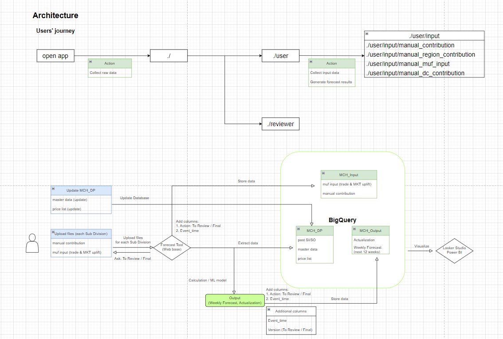

# App Design

App is packaged as a web app that allows users to upload assumption data. 

It extracts raw data from the main database (currently BigQuery - Google Cloud Service).

The backend server then processes the 2 dataset (input assumption & raw data),  generates forecast results, which are stored back to BigQuery or display the simulation to users.

## Features

Simulate forecast based on input assumptions for any period of time

Store final forecast Sell Out on database -> automatically convert to Sell In weekly and send emails to Operation involved team PIC (Trade, RSM, SO, IT, DP, SP, DRP, MPO, Production) 

Report tracking forecast performance (compare actual vs forecast, Accuracy, Bias,...)

## Architecture

